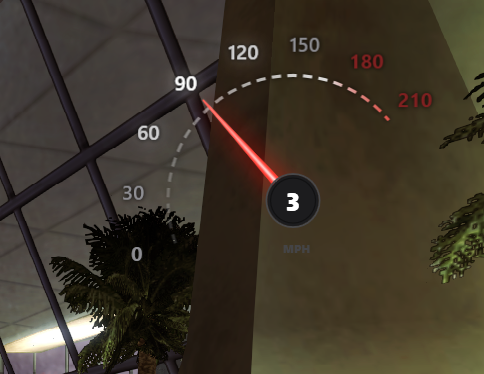

# dont use this
use `https://github.com/clod44/ExuiSpeedometer` instead

# Speedometer
exui template

## hwo to use
download everything as a zip. put this whole folder under "templates" folder.

practically speaking, you only need the .dll and .tff files to be present. rest is source code.

